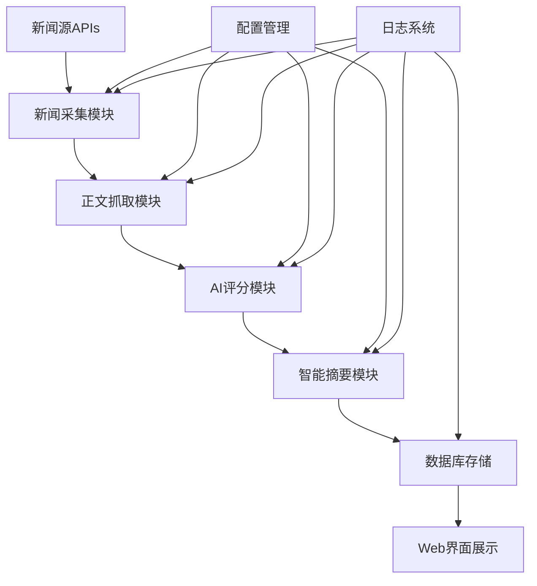
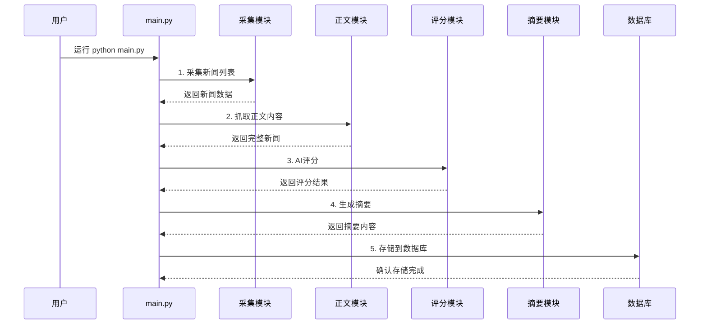

# 新闻采集与正文抓取自动化系统

## 📖 项目简介

本项目是一个**全自动化新闻采集与分析系统**，实现了多新闻源自动采集、正文抓取、AI智能评分与摘要总结的完整链路。具备高可用性、自动化、易维护等特点，支持关键词批量处理、自动适配反爬机制、详细日志追踪，并对依赖环境和驱动做了项目级隔离。

### ✨ 核心特性

- 🌐 **多源采集**：支持Google News、Baidu News、Bing News、DuckDuckGo News等主流新闻平台
- 🤖 **AI智能分析**：集成DeepSeek等大模型进行新闻评分和摘要生成
- 🔄 **全自动化**：一键运行完整流程，支持定时任务
- 📊 **数据可视化**：Web界面展示采集结果和统计数据
- 🛡️ **容错机制**：多重抓取策略，自动跳过已处理数据
- 📝 **详细日志**：完整的运行日志和错误追踪
- ⚡ **完善错误处理**：统一异常捕获、详细错误记录、断点续传支持

> ⚠️ **重要说明**：所有采集和正文抓取逻辑均严格筛选"昨天"的新闻，无法补充更早的历史新闻。

## 🚀 快速开始

### 环境要求

- **Python 3.8+** （推荐3.9+）
- **MySQL 5.7+** （用于数据存储）
- **Chrome浏览器** （Selenium/Playwright需要）

### 安装步骤

1. **克隆项目**
   ```bash
   git clone <repository-url>
   cd serp_news
   ```

2. **安装依赖**
   ```bash
   pip install -r requirements.txt
   ```

3. **安装Playwright浏览器**
   ```bash
   playwright install
   ```

4. **配置环境变量**
   
   创建`.env`文件：
   ```bash
   # API配置
   SERPAPI_KEY=your_serpapi_key
   DEEPSEEK_API_KEY=your_deepseek_api_key
   
   # 数据库配置
   MYSQL_HOST=localhost
   MYSQL_PORT=3306
   MYSQL_USER=your_username
   MYSQL_PASSWORD=your_password
   MYSQL_DB=serp_news
   ```

5. **创建数据库表**
   ```sql
   -- 新闻评分表
   CREATE TABLE scored_news (
       id INT AUTO_INCREMENT PRIMARY KEY,
       date VARCHAR(64),
       title VARCHAR(255),
       link TEXT,
       source VARCHAR(255),
       fetchdate DATE,
       sourceapi VARCHAR(255),
       thumbnail TEXT,
       keyword VARCHAR(255),
       content LONGTEXT,
       wordcount INT,
       custom_grab BOOLEAN,
       score INT
   );
   
   -- 新闻摘要表
   CREATE TABLE summary_news (
       id INT AUTO_INCREMENT PRIMARY KEY,
       date DATE,
       keyword VARCHAR(255),
       summary LONGTEXT,
       platform VARCHAR(255),
       model VARCHAR(255),
       round INT DEFAULT 1,
       judge_suggestion LONGTEXT
   );
   
   -- 新闻源统计表
   CREATE TABLE news_source_stats (
       id INT PRIMARY KEY AUTO_INCREMENT,
       date DATE NOT NULL,
       keyword VARCHAR(50) NOT NULL,
       domain VARCHAR(100) NOT NULL,
       count INT NOT NULL
   );
   
   -- 新闻网站表
   CREATE TABLE news_websites (
       id INT AUTO_INCREMENT PRIMARY KEY,
       website VARCHAR(255) UNIQUE,
       name VARCHAR(255)
   );
   ```

6. **配置关键词**
   
   编辑`config.py`中的关键词配置：
   ```python
   SEARCH_KEYWORDS = {
       "养老": ["养老"],
       "公积金": ["公积金"],
       "政府基金": ["政府基金", "引导基金", "母基金"],
       "你的关键词": ["搜索词1", "搜索词2"]
   }
   ```

### 🎯 一键运行

```bash
# 运行完整流程（采集 → 正文抓取 → AI评分 → 摘要生成 → 数据库存储）
python main.py

# 启动Web界面查看结果
python app.py
```

## 🛡️ 错误处理与日志系统

### 完善的错误处理机制
项目已集成**统一错误处理系统**，确保任何阶段出现错误都会被详细记录：

- **自动异常捕获**：使用`@with_error_handling`装饰器为关键函数添加错误处理
- **安全子进程执行**：`safe_subprocess_run`替代`os.system`，提供错误捕获和重试
- **全局异常处理**：捕获所有未处理的异常并记录
- **断点续传**：程序中断后可从上次失败的地方继续执行

### 详细日志记录
- **`output/error_log.txt`**：结构化错误日志，包含时间戳、脚本名、关键词、错误类型、详细信息等
- **`output/run_log.txt`**：程序运行状态日志，记录执行步骤、成功/失败统计、跳过原因等
- **实时控制台输出**：显示当前执行状态和进度

### 容错特性
- **单步骤失败不影响整体**：某个关键词处理失败不会中断其他关键词的处理
- **智能跳过机制**：自动跳过已处理的数据，避免重复工作
- **多级兜底策略**：正文抓取支持多种方式，API调用支持重试机制

## 📋 详细使用说明

### 1. 新闻采集

```bash
# 采集昨天所有关键词的新闻
python main.py

# 采集指定日期的新闻（用于补录）
python main.py 2025-06-01
```

### 2. 正文抓取

```bash
# 抓取指定关键词的正文（默认昨天）
python fetch_content.py 公积金

# 抓取指定日期的正文
python fetch_content.py 公积金 2025-06-01

# 测试模式
python fetch_content.py 公积金 --test

# 调试单条链接
python fetch_content.py test --url="https://news.example.com/xxx"
```

### 3. AI评分

```bash
# 批量评分所有关键词
python news_scorer.py

# 评分指定关键词和日期
python news_scorer.py 公积金 2025-06-01

# 单条测试
python news_scorer.py --test_json '{"title": "标题", "content": "正文", "keyword": "公积金"}'
```

### 4. 智能摘要

```bash
# 生成指定关键词的摘要
python news_summarizer.py --keyword 公积金 --date 2025-06-01

# 使用指定模型
python news_summarizer.py --keyword 公积金 --date 2025-06-01 --model qwen-plus-latest
```

### 5. 数据库操作

```bash
# 导入昨天的数据到数据库
python write_to_mysql.py

# 导入指定日期的数据
python write_to_mysql.py --date 2025-06-01
```

### 6. Web界面

```bash
# 启动Web服务（默认端口5000）
python app.py
```

访问 `http://localhost:5000` 查看：
- 📊 数据概览和统计
- 📰 新闻列表和详情

## 🔧 故障排查

### 查看错误日志
当程序执行异常时，可以查看以下日志文件：

```bash
# 查看详细错误日志
cat output/error_log.txt | tail -50

# 查看运行状态日志
cat output/run_log.txt | tail -50

# 查看最新的错误
grep "ERROR" output/error_log.txt | tail -10
```

### 常见问题解决
1. **API超时/失败**：系统自动重试3次，检查网络连接和API密钥
2. **正文抓取失败**：系统提供多种抓取方式，自动切换兜底策略
3. **数据库连接失败**：检查MySQL服务状态和连接配置
4. **程序中断**：可以重新运行，系统会自动跳过已处理的数据

### 错误日志说明
- **SUBPROCESS_ERROR**：子进程执行失败
- **API_ERROR**：API调用异常
- **FILE_READ_ERROR/FILE_WRITE_ERROR**：文件读写错误
- **DATABASE_ERROR**：数据库操作错误
- **PROGRAM_CRASH**：程序崩溃
- 💾 数据库内容展示
- 📁 文件下载功能

## 🏗️ 系统架构



## 📊 数据流程



## 🔧 近期主要更新（2024-06）

### ✨ 新功能

1. **三轮摘要流程**
   - 第一轮：初稿摘要生成
   - 第二轮：评判官建议 + 优化摘要
   - 第三轮：热点追踪（对比前一天摘要，识别持续热点）

2. **智能规则打分**
   - 支持在`config.py`中维护规则（标题/关键词匹配）
   - 命中规则的新闻直接给分，节省token成本
   - 日志详细记录规则打分情况

3. **关键词指定模型**
   - 支持为特定关键词指定专用模型
   - 如"国资委测试"使用`deepseek-chat`，其他用默认模型

4. **多模型配置支持**
   - 支持DeepSeek、百炼等多平台多模型
   - 自动token统计和模型切换

### 🛠️ 优化改进

- `write_to_mysql.py` 新增 `fetch_latest_summary` 功能
- `fetch_and_filter.py` 日志主关键词自动推断
- 所有多轮摘要、热点追踪结果自动保存
- 数据库写入、日志记录等细节优化

## 📁 目录结构

```
serp_news/
├── 📄 config.py                    # 配置文件
├── 🚀 main.py                      # 主程序入口
├── 📡 news_fetcher.py              # 新闻采集模块
├── 📝 fetch_content.py             # 正文抓取模块
├── 🤖 news_scorer.py               # AI评分模块
├── 📖 news_summarizer.py           # 智能摘要模块
├── 🗄️ write_to_mysql.py            # 数据库写入
├── 🌐 app.py                       # Web界面
├── ⚙️ config_grab_rules.py         # 抓取规则配置
├── 📋 requirements.txt             # 依赖包列表
├── 📊 output/                      # 输出目录
│   ├── 📅 2025-06-16/             # 按日期分类
│   │   ├── 📰 2025-06-16_公积金.json          # 原始新闻
│   │   ├── ⭐ 2025-06-16_公积金_scored.json   # 评分结果
│   │   ├── 📋 2025-06-16_公积金_summary.json  # 摘要结果
│   │   └── 🔍 raw_serp_*_公积金_*.json       # 原始API响应
│   ├── 📜 run_log.txt             # 运行日志
│   ├── 🌐 news_sources.txt        # 新闻源域名
│   └── 📈 news_source_stats.json  # 采集统计
├── 🎨 templates/                   # Web模板
│   ├── index.html
│   ├── date.html
│   ├── database.html
│   └── keyword_select.html
├── 🤖 deepseek_v3_tokenizer/       # DeepSeek tokenizer
└── 📖 README.md                    # 项目文档
```

## 📊 数据格式说明

### 新闻数据结构

每条新闻的JSON结构（2024-06统一规范）：

```json
{
  "title": "新闻标题",
  "link": "新闻链接",
  "source": "新闻来源",
  "date": "原始API返回的时间字符串，如 '1 day ago'、'昨天'",
  "fetchdate": "抓取日期，格式如 '2025-06-06'",
  "sourceapi": "采集来源标记，如 'serp_googlenews'",
  "thumbnail": "缩略图链接（如有）",
  "keyword": "主关键词",
  "main_keyword": "主关键词（与keyword一致）",
  "search_keyword": "实际搜索关键词",
  "content": "正文内容（正文抓取后补充）",
  "wordcount": 123,
  "custom_grab": false,
  "score": 4
}
```

### 摘要数据结构

```json
{
  "date": "2025-06-16",
  "keyword": "公积金",
  "summaries": [
    {
      "summary": "摘要内容...",
      "platform": "deepseek",
      "model": "deepseek-reasoner",
      "round": 1
    },
    {
      "summary": "优化后摘要...",
      "platform": "deepseek", 
      "model": "deepseek-reasoner",
      "round": 2,
      "judge_suggestion": "评判官建议..."
    }
  ]
}
```

## ⚙️ 关键词配置机制

### 新机制说明

采用"主关键词+搜索用关键词"映射机制，提升采集灵活性：

- **主关键词**：关心的主题词，用于后续打分、摘要、数据库写入等
- **搜索用关键词**：实际用于采集的关键词，可以有多个
- **采集时**：遍历所有搜索用关键词，结果归属于主关键词
- **处理时**：以主关键词为核心进行后续流程

### 配置示例

```python
SEARCH_KEYWORDS = {
    "养老": ["养老"],
    "公积金": ["公积金"],
    "政府基金": ["政府基金", "引导基金", "母基金"],
    "江苏国资委": ["江苏省国资委", "南京市国资委", "江苏交通控股"]
}
```

## 🎯 正文抓取策略

### 多重抓取顺序

1. **trafilatura** - 高效静态正文提取
2. **newspaper3k** - 新闻站点适配性强
3. **Playwright** - 渲染页面后提取
   - 先用Newspaper3k提取
   - 失败再用Readability提取
4. **Selenium** - 定制化抓取兜底

### 定制化规则

针对特定站点的专属选择器，配置在`config_grab_rules.py`：

```python
CUSTOM_GRAB_RULES = [
    (lambda url: 'example.com' in url, grab_example_content),
    (lambda url: 'news.site.com' in url, grab_news_site_content),
    # 添加更多规则...
]
```

## 🤖 AI评分系统

### 评分规则

- **5分**：全国性、中央级新闻；政府政策制度
- **4分**：重要省市新闻；创新性、重大意义新闻
- **3分**：一般省市、一般新闻
- **2分**：仅部分相关内容
- **1分**：非中国新闻；广告宣传内容
- **0分**：不相关内容

### 规则打分

支持预设规则直接给分，节省API调用：

```python
NEWS_RULE_BASED_SCORING = [
    {
        'main_keyword': '公积金',
        'title_contains': '降息',
        'score': 5
    }
]
```

### 模型选择

支持关键词指定模型：

```python
# 在news_scorer.py中
model_to_use = 'deepseek-chat' if keyword == '国资委测试' else 'deepseek-reasoner'
```

## 📝 智能摘要系统

### 三轮摘要流程

1. **第一轮**：基于3分及以上新闻生成初稿摘要
2. **第二轮**：评判官评估 + 优化建议 + 改进摘要
3. **第三轮**：热点追踪（对比前一天摘要，识别持续热点）

### 摘要结构

- **今日综述** (200-300字)：整体概述和核心事件
- **新闻总结** (400-600字)：分类整理要点和背景
- **观点总结** (200-300字)：各方观点和评论

### 多模型支持

```python
NEWS_SUMMARY_MODELS = {
    "deepseek": {
        "deepseek-reasoner": {...},
        "deepseek-chat": {...}
    },
    "bailian": {
        "qwen-max": {...},
        "qwen-plus-latest": {...}
    }
}
```

## 🗄️ 数据库设计

### 主要数据表

- **scored_news**：新闻评分数据
- **summary_news**：新闻摘要数据
- **news_source_stats**：新闻源统计
- **news_websites**：新闻网站信息

### 数据写入

- 自动查重（title+link）
- 批量导入支持
- 详细日志记录
- 支持指定日期导入

## 🌐 Web界面功能

### 主要页面

- **首页**：日期列表和数据概览
- **日期页面**：指定日期的新闻数据
- **关键词选择**：按关键词筛选新闻
- **数据库页面**：数据库内容展示

### 功能特性

- 📊 实时数据统计
- 🔍 关键词筛选
- 📁 文件下载
- 📱 响应式设计

## ❓ 常见问题

### Q1: 能否补抓历史数据？

**A:** 不支持补抓历史数据。系统严格筛选"昨天"的新闻，请确保每日定时运行避免数据缺失。

### Q2: 如何调试正文抓取？

**A:** 使用调试命令：
```bash
python fetch_content.py test --url="https://news.example.com/xxx"
```

### Q3: Playwright/Selenium报错怎么办？

**A:** 
- 首次运行需执行 `playwright install`
- Selenium会自动下载ChromeDriver，如有问题可清理缓存重试

### Q4: 如何添加新的新闻源？

**A:** 在`news_fetcher.py`中添加新的采集函数，并在主流程中调用。

### Q5: 如何自定义评分规则？

**A:** 在`config.py`中的`NEWS_RULE_BASED_SCORING`添加新规则。

### Q6: 如何优化抓取成功率？

**A:** 在`config_grab_rules.py`中添加针对特定站点的定制化规则。

## 🔧 扩展开发

### 添加新闻源

1. 在`news_fetcher.py`中实现新的采集函数
2. 在主流程中添加调用逻辑
3. 更新配置文件中的相关参数

### 自定义抓取规则

1. 在`config_grab_rules.py`中添加匹配函数和抓取函数
2. 将规则添加到`CUSTOM_GRAB_RULES`列表
3. 测试验证抓取效果

### 集成新的AI模型

1. 在`config.py`中添加模型配置
2. 在相应模块中实现模型调用逻辑
3. 更新token统计和错误处理

## 📈 性能优化

### 并发处理

- 新闻采集支持多线程
- 正文抓取可配置并发数
- AI评分支持批量处理

### 缓存机制

- 自动跳过已处理文件
- 支持断点续传
- 智能重试机制

### 资源管理

- 浏览器实例复用
- 内存使用优化
- 临时文件自动清理

## 🚀 部署指南

### 生产环境部署

1. **服务器配置**
   ```bash
   # 安装系统依赖
   sudo apt-get update
   sudo apt-get install python3 python3-pip mysql-server
   
   # 安装Chrome（用于Selenium/Playwright）
   wget -q -O - https://dl.google.com/linux/linux_signing_key.pub | sudo apt-key add -
   sudo sh -c 'echo "deb [arch=amd64] http://dl.google.com/linux/chrome/deb/ stable main" >> /etc/apt/sources.list.d/google-chrome.list'
   sudo apt-get update
   sudo apt-get install google-chrome-stable
   ```

2. **定时任务设置**
   ```bash
   # 编辑crontab
   crontab -e
   
   # 添加定时任务（每天早上8点运行）
   0 8 * * * cd /path/to/serp_news && python main.py >> /var/log/serp_news.log 2>&1
   ```

3. **Web服务部署**
   ```bash
   # 使用gunicorn部署
   pip install gunicorn
   gunicorn -w 4 -b 0.0.0.0:5000 app:app
   
   # 或使用nginx + uwsgi
   pip install uwsgi
   uwsgi --ini uwsgi.ini
   ```

### Docker部署

```dockerfile
FROM python:3.9-slim

WORKDIR /app
COPY requirements.txt .
RUN pip install -r requirements.txt

COPY . .
RUN playwright install

EXPOSE 5000
CMD ["python", "app.py"]
```

## 📊 监控与维护

### 日志监控

- 所有操作记录在`output/run_log.txt`
- 支持日志轮转和归档
- 错误自动告警（可配置）

### 性能监控

- 采集成功率统计
- 抓取耗时分析
- API调用量监控
- 存储空间使用

### 数据备份

```bash
# 数据库备份
mysqldump -u username -p serp_news > backup.sql

# 文件备份
tar -czf output_backup.tar.gz output/
```

## 🤝 贡献指南

### 开发环境搭建

1. Fork项目到个人仓库
2. 克隆到本地开发环境
3. 创建开发分支
4. 安装开发依赖

### 代码规范

- 使用Python PEP8编码规范
- 添加必要的注释和文档
- 编写单元测试
- 提交前运行代码检查

### 提交流程

1. 创建功能分支
2. 完成开发和测试
3. 提交Pull Request
4. 代码审查和合并

## 📄 许可证

本项目采用MIT许可证，详见LICENSE文件。

## 👥 作者信息

- **作者/维护者**：liuliang
- **最后更新**：2024-06
- **联系方式**：[请添加联系方式]

## 🙏 致谢

感谢以下开源项目的支持：
- [trafilatura](https://github.com/adbar/trafilatura) - 网页正文提取
- [newspaper3k](https://github.com/codelucas/newspaper) - 新闻文章处理
- [Playwright](https://github.com/microsoft/playwright-python) - 浏览器自动化
- [Selenium](https://github.com/SeleniumHQ/selenium) - Web自动化
- [Flask](https://github.com/pallets/flask) - Web框架

---

如有问题或需要定制化扩展，欢迎提交Issue或联系开发者。