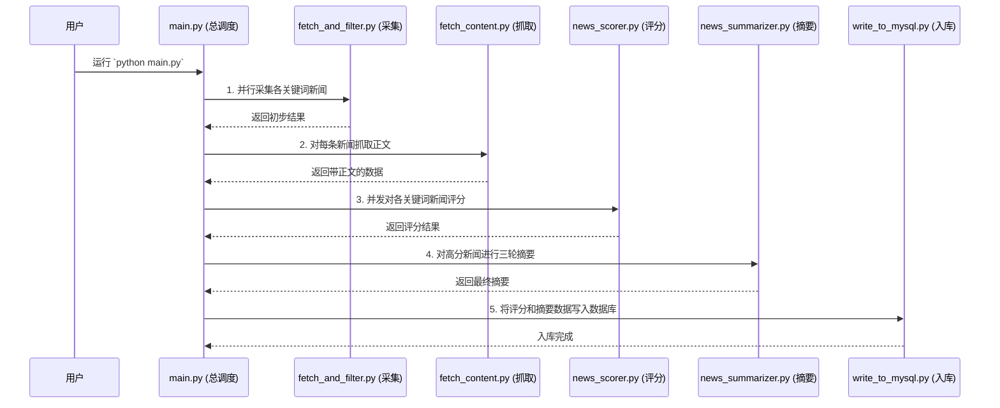

# 新闻采集与分析自动化系统 - 功能需求文档

> **注意**：此文档部分内容已过时。当前系统为7步流水线，模块名称和关键词已变更。请参考 `README.md` 和 `CLAUDE.md`。

## 📋 项目概述

### 项目目标
本项目是一个**全自动、智能化的新闻处理流水线**。把它想象成一个不知疲倦的机器人团队，7x24小时为你工作。它们的目标是：
1.  **自动“阅读”**：从各大新闻网站上，把跟你关心的关键词（如“养老”、“公积金”）相关的新闻都找回来。
2.  **智能“理解”**：用AI大脑深度阅读每篇新闻，判断它的重要性，并写出高质量的摘要。
3.  **整齐“归档”**：把所有处理好的信息，分门别类地存入我们的专属数据库和文件柜，方便随时查看和分析。

### 核心价值
- **信息不再错过**：自动汇聚多个主流新闻平台的信息，让你对关心的领域了如指掌。
- **效率就是生命**：从繁琐的人工浏览和复制粘贴中解放出来，让AI为你处理海量信息。
- **数据驱动决策**：通过结构化的数据和智能分析，帮你快速洞察热点，发现价值。
- **完全无人值守**：设定好任务后，系统会自动运行，真正实现“一次设定，长期受益”。

## 🎯 功能模块设计

我们的“新闻工厂”由七个高效协作的模块组成，就像一条精密的流水线。

### 模块1：新闻采集系统 (信息侦察兵)
**功能描述**：这是我们的信息侦察兵团队，负责从多个新闻源API自动采集新闻数据。

**工作方式**：
- **多平台出击**：侦察兵们会同时前往Google News、百度新闻、必应新闻等多个平台。
- **关键词精准锁定**：你可以告诉它们要找什么“主关键词”（如“政府基金”），它们会自动使用更具体的“搜索关键词”（如“引导基金”、“母基金”）进行搜索，确保信息全面。
- **初步筛选与整理**：它们会将找到的新闻链接、标题、来源等信息统一格式，并剔除重复的内容，最后把初步战果存成一个干净的JSON文件。

### 模块2：正文抓取系统 (万能钥匙)
**功能描述**：这个模块拥有一串“万能钥匙”，负责打开新闻链接，把完整的正文内容给拿回来。

**工作方式**：
这个模块非常智能，它会按顺序尝试多种方法，直到成功抓取正文为止：
1.  **专用钥匙（定制化规则）**：对特定网站，使用最高效的专用规则。
2.  **专业工具箱（`trafilatura`, `newspaper3k`等）**：使用业界领先的工具库尝试直接提取。
3.  **模拟浏览器（Playwright/Selenium）**：如果遇到需要“登录”或“点击加载更多”才能显示的复杂网页，它会启动一个真实的浏览器，像人一样操作，确保能拿到最终内容。

这个强大的“多级兜底”策略，是我们系统高成功率的保证。

### 模块3：AI智能评分系统 (首席评审官)
**功能描述**：这个模块是我们的首席评审官，它会阅读每一篇新闻，并根据其重要性给出一个1-5分的评分。

**评分规则**：
- **5分**：国家级政策、对全国有重大影响的事件。
- **4分**：重要省市的新闻、行业内的重大创新或突破。
- **3分**：一般性新闻。
- **2分**：和主题沾边，但关系不大的新闻。
- **1分**：广告、软文或海外无关新闻。
- **0分**：完全不相关。

**工作方式**：
- **AI模型评分**：利用DeepSeek等先进的AI大模型进行深度语义理解和评分。
- **并发处理**：为了提高效率，系统会像银行开放多个窗口一样，**同时处理多个关键词的评分任务**，大大缩短了等待时间。

### 模块4：智能摘要系统 (内容创作团队)
**功能描述**：这是我们最高级的模块，一个由AI组成的“内容创作团队”，负责将筛选出的高分新闻（3分以上）精炼成一份高质量的决策参考。

**工作方式（三轮优化流程）**：
1.  **第一轮：初稿撰写**
    - “写手AI”首先阅读所有高分新闻，撰写出一份包含“今日综述”、“新闻总结”、“观点总结”的初稿。
2.  **第二轮：专家评审与优化**
    - “编辑AI”会以批判性的眼光审查初稿，并提出详细的优化建议。
    - “写手AI”根据这些建议，对摘要进行修改和润色，生成第二版更完善的摘要。
3.  **第三轮：热点追踪**
    - “分析师AI”会对比前一天的摘要，识别出连续出现的热点事件，并进行标注和分析。

这个精密的流程确保了我们产出的不只是简单的信息堆砌，而是真正有深度、有洞察的分析报告。

### 模块5：数据库存储系统 (数字图书馆)
**功能描述**：这是一个自动化的“数字图书馆”，负责将前面所有模块处理好的数据，永久、安全、有序地存储到MySQL数据库中。

**馆藏分类**：
- **`scored_news` 书架**：存放每一篇新闻的原文、评分等详细信息。
- **`summary_news` 书架**：存放每天生成的、经过三轮优化的精华摘要。
- **`news_source_stats` 索引卡**：统计每天的新闻都来自哪些网站，帮助我们分析信息来源。
- **`news_websites` 名录**：记录所有我们接触过的新闻网站。

**工作方式**：
- **智能查重**：在存入数据前，会检查是否已存在（基于标题和链接），绝不重复存入。
- **质量过滤**：会自动过滤掉没有抓取到正文的空数据。
- **批量写入**：采用优化的方式批量写入，提高效率。

### 模块6：Web可视化界面 (中央控制台)
**功能描述**：我们为这个强大的系统配备了一个简洁直观的Web界面，就像是整个工厂的“中央控制台”。

**核心功能**：
- **数据驾驶舱**：通过图表和统计数据，让你对每日采集成果一目了然。
- **新闻浏览器**：可以方便地按日期、按关键词查看所有新闻的原文、评分和摘要。
- **文件管理器**：可以直接在网页上下载输出的JSON文件和日志。
- **数据库浏览器**：直接查看数据库中存储的内容。

### 模块7：错误处理与日志系统 (安全与监控中心)
**功能描述**：这是我们系统的“安全与监控中心”，确保系统在遇到意外时能够稳定运行，并记录下所有关键操作。

**核心功能**：
- **全方位安全网**：通过精巧的装饰器模式，为系统的每个关键环节都加上了保护，即使某个小环节出错，也不会导致整个程序崩溃。
- **结构化日志**：
  - `run_log.txt`: 详细记录了系统每天的运行情况，谁在什么时间做了什么，一清二楚。
  - `error_log.txt`: 当发生错误时，会在这里记录下详尽的错误报告，便于我们快速定位和解决问题。

## 🛠️ 技术架构设计

### 系统架构图
```mermaid
graph TD
    subgraph "外部依赖"
        A[新闻源APIs]
        B[AI大模型API]
        C[MySQL数据库]
    end

    subgraph "自动化新闻系统"
        M1[模块1: 新闻采集]
        M2[模块2: 正文抓取]
        M3[模块3: AI评分]
        M4[模块4: 智能摘要]
        M5[模块5: 数据库存储]
        M6[模块6: Web界面]
    end
    
    subgraph "支撑系统"
        S1[配置管理<br/>(config.py, .env)]
        S2[错误处理与日志<br/>(error_handler.py, logger_utils.py)]
    end

    A --> M1
    M1 --> M2
    M2 --> M3
    B --> M3
    M3 --> M4
    B --> M4
    M4 --> M5
    M3 --> M5
    M5 --> C
    M5 --> M6
    C --> M6

    S1 -- 控制 --> M1
    S1 -- 控制 --> M2
    S1 -- 控制 --> M3
    S1 -- 控制 --> M4
    S1 -- 控制 --> M5
    
    S2 -- 监控 --> M1
    S2 -- 监控 --> M2
    S2 -- 监控 --> M3
    S2 -- 监控 --> M4
    S2 -- 监控 --> M5
    S2 -- 监控 --> M6
```

### 数据流程图


## 📊 数据格式规范

### 新闻数据结构 (JSON)
```json
{
  "title": "新闻标题",
  "link": "新闻链接",
  "source": "新闻来源",
  "date": "原始API返回的时间字符串",
  "fetchdate": "抓取日期，格式YYYY-MM-DD",
  "sourceapi": "采集来源标记，如serp_googlenews",
  "thumbnail": "缩略图链接（可选）",
  "keyword": "主关键词",
  "search_keyword": "实际搜索关键词",
  "content": "抓取到的正文内容",
  "wordcount": 123,
  "custom_grab": true,
  "score": 4
}
```

### 摘要数据结构 (JSON)
```json
{
  "date": "2025-06-16",
  "keyword": "公积金",
  "summaries": [
    {
      "summary": "第一轮生成的摘要内容...",
      "platform": "deepseek",
      "model": "deepseek-reasoner",
      "round": 1
    },
    {
      "summary": "经过优化后的最终摘要...",
      "platform": "deepseek", 
      "model": "deepseek-reasoner",
      "round": 2,
      "judge_suggestion": "评判官AI给出的优化建议..."
    }
  ]
}
```

## ⚙️ 环境与配置

### 基础环境
- **Python 3.8+**
- **MySQL 5.7+**
- **Chrome浏览器**

### Python依赖包
```
requests
flask
pymysql
python-dotenv
selenium
playwright
trafilatura
newspaper3k
openai
beautifulsoup4
lxml
transformers
torch  # 建议安装，用于deepseek本地tokenizer
tiktoken
webdriver-manager
readability-lxml
```

### 关键配置文件
- **`.env`**: 用于存放数据库连接、API密钥等所有敏感信息，请勿提交到代码仓库。
- **`config.py`**: 定义了系统的核心参数，如关键词列表、模型名称、默认Prompt等。
- **`config_grab_rules.py`**: 定义了针对特定网站的定制化抓取规则。

## ✨ 已实现功能亮点与未来展望

### 已实现的核心功能
- **[完成]** **全自动处理流水线**：从采集到入库，实现一键自动化运行。
- **[完成]** **多源并行采集**：同时从多个主流新闻平台获取信息。
- **[完成]** **多级兜底正文抓取**：结合定制规则、多种库和模拟浏览器，抓取成功率极高。
- **[完成]** **并发AI评分**：高效地对海量新闻进行并行评分。
- **[完成]** **三轮优化智能摘要**：通过“写作-评审-优化”的精细流程，产出高质量摘要。
- **[完成]** **结构化数据存储**：将所有结果有序存入MySQL，便于后续分析。
- **[完成]** **Web可视化界面**：提供友好的界面来查看和管理数据。
- **[完成]** **健壮的错误处理与日志**：保证系统稳定运行和过程可追溯。

### 未来展望
我们的“新闻工厂”已经非常强大，但总有变得更酷的空间。未来我们可以探索：
- **增量更新与热点演化分析**：不仅追踪热点，更能分析一个热点事件的完整生命周期。
- **前端交互优化**：在Web界面上增加更多数据筛选、图表分析和手动干预功能。
- **接入更多信息源**：除了新闻，还可以接入如社交媒体、行业报告等更多类型的数据源。
- **知识图谱构建**：将新闻中的实体（人名、地名、公司名）提取出来，构建它们之间的关系网络。

---

这份文档现在就像我们项目的“身份证”，清晰地展示了它的能力和价值。希望这份新蓝图能让你对我们的项目有更深的理解和自豪感！如果还有任何问题，随时可以找我聊。
